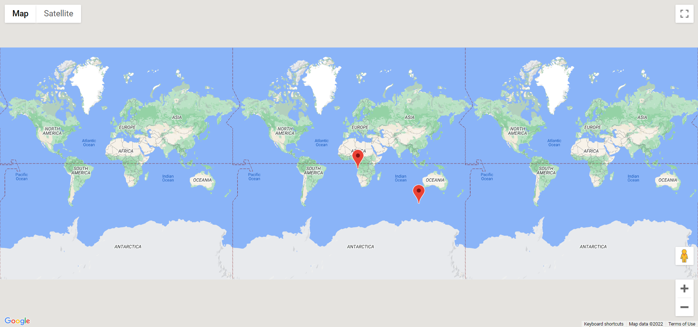

# 📌 google-maps-typescript

This project is made to learn the basics of **typescript + classes** design pattern.

#### What it does 🤔?

It uses **@faker-js/faker** to generates a random **user** and a **company** along with there positions as _latitude_ and _longitude_. These **user** and **company** are then showed on a map using google maps API:

That's all it does...🙂

